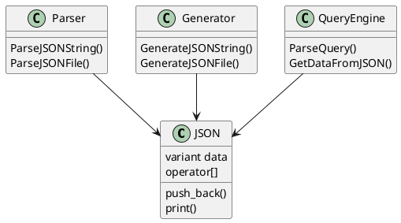

# C++ JSON Parser and Query Tool

## Overview

This project implements a **lightweight JSON parser written in C++**.  
It reads JSON files, converts them into internal C++ objects, and allows querying the data using a simple command-line syntax.

The parser is implemented using modern C++ features such as:

- `std::variant`
- `std::optional`
- `std::map`
- `std::vector`
- `std::stringstream`

The program can:

- Parse JSON files
- Store JSON values in C++ objects
- Print JSON in formatted form
- Query JSON data using a dot (`.`) path
- Export JSON objects to files

---

# Features

- JSON file parsing
- JSON string parsing
- Support for multiple JSON data types
- Command-line JSON querying
- Pretty printing of JSON structures
- Export JSON objects to files
- Recursive parsing for nested objects and arrays
- Implementation using standard C++ STL containers

Supported JSON types:

- Integer
- Floating point numbers
- Strings
- Boolean values
- Arrays
- Objects
- Null values

---

# Project Structure

Example project directory structure:

```
project/
│
├── include/
│   └── JsonParser.hpp
│
├── src/
│   ├── JsonParser.cpp
│   ├── main.cpp
│   └── export.cpp
│
├── data/
│   └── Data.txt
│
├── output/
│   └── Export.txt
│
└── README.md
```

### File Descriptions

| File | Description |
|-----|-------------|
| `JsonParser.hpp` | JSON class declaration and parser function prototypes |
| `JsonParser.cpp` | Implementation of JSON parser and helper functions |
| `main.cpp` | Command line JSON query tool |
| `export.cpp` | Example program that reads JSON and exports it to a file |
| `Data.txt` | Example JSON input file |
| `Export.txt` | Output file generated by the program |

---

# JSON Data Structure

The JSON object is implemented using `std::variant` to store different possible data types:

```cpp
std::variant<
    int,
    float,
    bool,
    std::string,
    std::vector<JSON>*,
    std::map<std::string, JSON>*
>
```

This allows the JSON object to dynamically store any JSON value type.

Supported operations include:

- Accessing object elements using `operator[]`
- Adding elements to arrays
- Printing JSON objects
- Generating JSON strings and files

---

# System Architecture (PlantUML)

The following diagram shows the relationship between the main components.



---

# Requirements

To build this project you need:

- A **C++17 compatible compiler**
- Standard C++ libraries

Recommended compilers:

- `g++`
- `clang++`

---

# Installing Dependencies

### Ubuntu / Debian

Install the C++ compiler:

```bash
sudo apt install g++
```

Check compiler version:

```bash
g++ --version
```

Make sure the compiler supports **C++17**.

---

# Build Instructions

Compile the project using `g++`:

```bash
g++ -std=c++17 src/*.cpp -o json_parser
```

This will produce the executable:

```
json_parser
```

---

# Running the Program

The program accepts two parameters:

```
./json_parser <json_file> <query>
```

Example:

```bash
./json_parser data/Data.txt name
```

The program will:

1. Open the JSON file
2. Parse the contents
3. Apply the query
4. Print the result

---

# Example JSON File

Example JSON input (`data/Data.txt`):

```json
{
  "name": "Hesham",
  "age": 22,
  "student": true,
  "skills": ["C++", "Python"]
}
```

---

# Example Queries

Query a single value:

```bash
./json_parser data/Data.txt name
```

Output:

```
"Hesham"
```

Query another field:

```bash
./json_parser data/Data.txt age
```

Output:

```
22
```

Query an array:

```bash
./json_parser data/Data.txt skills
```

Output:

```
[ "C++", "Python" ]
```

---

# JSON Parsing Process

The parser works in several stages:

1. The JSON file is opened using `std::ifstream`.
2. The entire file content is loaded into a `std::stringstream`.
3. Characters are analyzed to detect JSON tokens.
4. Objects and arrays are parsed recursively.
5. The resulting structure is stored in a `JSON` object.

Main parsing functions:

- `ParseJSONString()` – Parses JSON from a string.
- `ParseJSONFile()` – Reads JSON data from a file.
- `GetNumFromString()` – Converts numbers, booleans, and null values.
- `GetArrFromString()` – Parses JSON arrays.
- `GetStringFromString()` – Parses string values.

---

# Exporting JSON

The project also allows exporting JSON data back to files.

Example:

```cpp
std::ofstream OutFile("./output/Export.txt");
GenerateJSONFile(jsonObject, OutFile);
```

This writes the JSON structure into the output file.

---

# Error Handling

The program includes basic error handling for:

- Invalid command line arguments
- Invalid file paths
- Incorrect JSON format
- Failed parsing operations

Error messages are printed to `stderr`.

---

# Future Improvements

Possible improvements include:

- Support for array indexing in queries
- Better memory management
- Improved JSON validation
- More descriptive error messages
- Performance optimizations
- Support for very large JSON files

---

# Author

Developed as a **C++ programming project** to demonstrate:

- JSON parsing techniques
- Data structure design
- File handling in C++
- Use of modern C++ features

